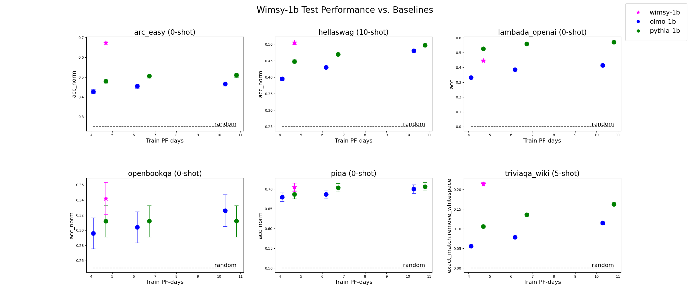
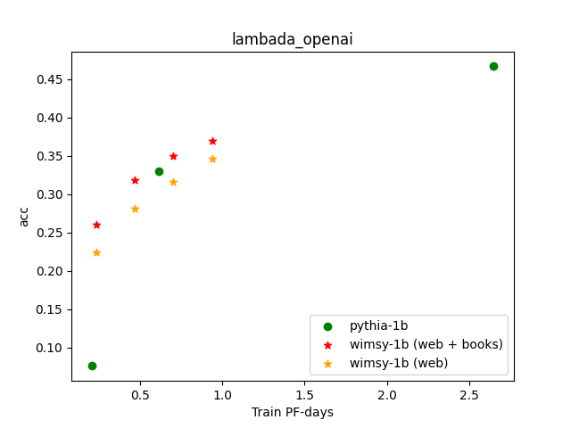

# Wimsy

## What's Wimsy? 

Wimsy is a general purpose, dense, decoder-only LLM that will come in two sizes: Wimsy-1b and Wimsy-7b. 

Wimsy-1b, which is trained on 50B tokens, is complete (huggingface checkpoint coming soon). 

Wimsy-7b, which will be trained on 300B tokens, is currently under development (pre-training run kicking off in ~2 weeks).

## Where can I learn more? 

Checkout [this talk](https://drive.google.com/file/d/180WavTPjZOD6qiwNefjoHE0AMa4JD0tT/view?usp=sharing) I gave at essential.ai on Wimsy-1b! 

## How good is Wimsy? 

Wimsy-1b performs comparable to or better than baselines (olmo-1b & pythia-1b), which were trained on 2x as much data, on 5/6 of our test sets. 

On the Lambada test set, we find that pythia-1b outperforms Wimsy-1b at the ~4 PF-day scale. 

In ablations we demonstrate that this gap is due to pythia-1b being trained on the books corpus, from which the Lambada dataset is constructed.

See the plots of our results below! 

#### Wimsy-1b Test Performance vs. Baselines

#### Wimsy-1b Ablation: Lambada Performance When Pre-training With vs. Without Books Corpus 

